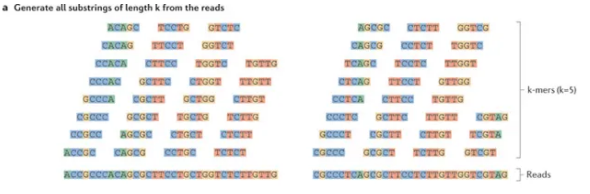

# De-novo Transcriptome Assembly Tutorial Using **Trinity**


# <sub>**Background**


* **k-mers**




* **de Bruijn to Assembly**

Instead of reference genome, de Bruijn graphs are used as a reference in de-novo assembly.


The best paths which are supported by reads are chosen.

* **Overview of Trinity**


  Inchworm : Reports highly expressed isoforms as single full length contigs, and unique regions of alternatively spliced isoforms as separate contigs.
  
  Chrysalis: Links related Inchworm contigs by using overlapping k-mers in order to regroup contigs. Then, it builds de Bruijn graphs from overlapping k-mers & sequences with branches at sites of variation. One graph per gene, ideally.

  Butterfly: Builds the most probable assembly for full length transcripts of isoforms and paralogs. It can distinguish paralogs, indeed.

# <sub>**Syntax**

* Required :
```
--seqType <string>  : type of reads ( fa, or fq )  

--max_memory <string> : suggested max memory to use by Trinity where limiting can be enabled. 

If paired reads: 

--left  <string>   : left reads, one or more file names (separated by commas, not spaces)
--right <string>: right reads, one or more file names (separated by commas,not spaces)

If unpaired reads: 

--single <string> : single reads, one or more file names, comma-delimited (note, if single file contains pairs, can use flag: --run_as_paired)
```

* Optional :

```
--CPU <int> : number of CPUs to used default: 2

--min_contig_length <int>  : minimum assembled contig length to report (def=200)

--long_reads <string>   : fasta file containing error-corrected or circular consensus (CCS) pac bio reads

--genome_guided_bam <string>   : genome guided mode

--trimmomatic  : run Trimmomatic to quality trim reads
```

Basic Trinity Command :  
```
Trinity --seqType fq --left reads_1.fq --right reads_2.fq --CPU 6 --max_memory 20G
```
Multiple fastq files :
```
Trinity --seqType fq --max_memory 50G  \
 --left condA_1.fq.gz, condB_1.fq.gz, condC_1.fq.gz \
 --right condA_2.fq.gz, condB_2.fq.gz, condC_2.fq.gz  \ 
 --CPU 6

Or, create a tab-delimited file: 

 --samples_file sample.txt 
 
sample.text:
 cond_A cond_A_rep1 A_rep1_left.fq A_rep1_right.fq 
 cond_A cond_A_rep2 A_rep2_left.fq A_rep2_right.fq
 cond_B cond_B_rep1 B_rep1_left.fq B_rep1_right.fq
 cond_B cond_B_rep2 B_rep2_left.fq B_rep2_right.fq
```

Reference Assembly :

```
Trinity --genome_guided_bam rnaseq_alignments.csorted.bam --max_memory 50G --genome_guided_max_intron 10000 --CPU 6
```

# <sub>**Assembly Statistics**

***Number of transcripts*** may give you some idea, but it is not statistically informative. As you sequence deeper,  you already get more transcipts. (?) \

***N50*** gives minimum contig length that covers 50% of genome. Sensitive to the form of isoforms (?)\

***Representation of reads*** to the assembly.


# <sub>**Hands-on**
1. Go to your working directory for this tutorial \
  (if you don't have make one)
2. Copy the tutorial folder
``` 
cp -r /cta/users/ainan/gwsta_trinity_tutorial gwsta_trinity_tutorial
```

3. Run Trinity (EVERYTHING IS ALREADY IN THE SHELL SCRIPT)\
  It takes around 20 minutes
```
sbatch slurm_trinity.sh
```


4.  **Now, we will talk about assembly! Later, we will go back to hands-on part.**

5. Run perl script from your working directory for assembly statistics
```
perl /cta/apps/opt/spack/linux-ubuntu16.04-x86_64/gcc-8.2.0/trinity-2.6.6-y6rgxzwidaloosdtwksjxgqhethrs6ls/bin/util/TrinityStats.pl trinity_out_dir/Trinity.fasta
``` 
6. Run the second part of assembly statistics with Bowtie2 to view read representation on the assembly
```
bowtie2-build trinity_out_dir/Trinity.fasta trinity_out_dir/Trinity.fasta

bowtie2 --local --no-unal -x trinity_out_dir/Trinity.fasta -q -1 Sp_ds.left.fq -2 Sp_ds.right.fq | samtools view -b | samtools sort -o bowtie2.bam
```
# <sub>**One Step Further**

Performance is better with ***strand-specific RNA-seq*** data. Sense and antisense transcrption is separated.
Single transcripts that cover both genes which are transcribed from oppsite strands. That reveals overlapping UTRs.
Also, antisense dominated transcription of a gene is detected among other genes from the same strand.

# <sub>**References**

Data from Trinity Workshop which is on the Trinity GitHub page.

Martin, J., Wang, Z. Next-generation transcriptome assembly. Nat Rev Genet 12, 671–682 (2011). https://doi.org/10.1038/nrg3068

Haas BJ, Papanicolaou A, Yassour M, Grabherr M, Blood PD, Bowden J, Couger MB, Eccles D, Li B, Lieber M, Macmanes MD, Ott M, Orvis J, Pochet N, Strozzi F, Weeks N, Westerman R, William T, Dewey CN, Henschel R, Leduc RD, Friedman N, Regev A. De novo transcript sequence reconstruction from RNA-seq using the Trinity platform for reference generation and analysis. Nat Protoc. 2013 Aug;8(8):1494-512. Open Access in PMC doi: 10.1038/nprot.2013.084. Epub 2013 Jul 11. PubMed PMID:23845962.

# <sub>**Useful Links**

Video explanation: https://www.broadinstitute.org/broade/trinity-screencast
